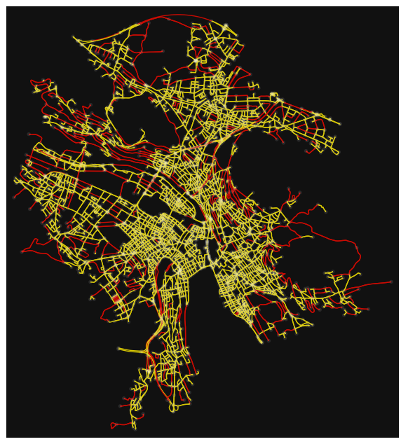
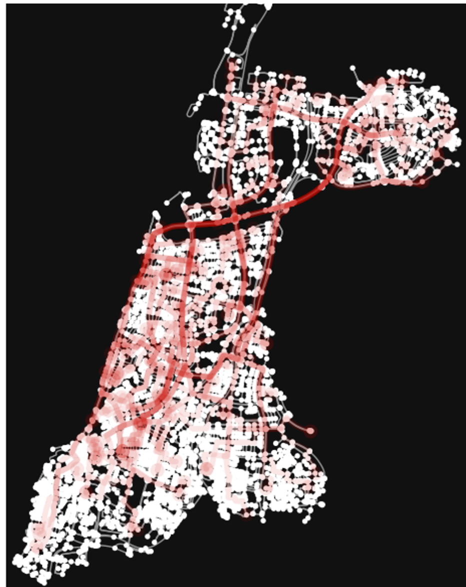

                                               
#                                 GAMES 
 <div style="text-align:center;">
  
</div>
## Installation 
Use python 3.9\
Needed packages are in requirements.txt\
`pip install -r requirements.txt`
 
## Data  
Raw data can be shared among the partners of the project (GAMES) and must be placed in the following folders:  
- `datasets/autotel`
- `datasets/windkraft_simonsfeld`
- `datasets/mobility`
 
Simulated mobility scenarios are available. For instance, the directory `./mobility/simulated` contains the following files:
- `sim_reserv_df_in_zurich_1_day_from_userdemand.csv`: Simulated reservations for one day in Zurich (generated using a pool of user demands for mobility).
- `sim_presence_matrx_in_zurich_6_months_statistical_sampler.csv`: Simulated presence matrix for six months in Zurich (generated with a statistical sampler).

## What to run
  
* demo_traffic_model
```python
# Defne macroscopic traffic model &  street network for two geographical regions 
TelAviv = Macroscopic_traffic_model(geographical_area = 'Tel Aviv, Israel')
Zurich = Macroscopic_traffic_model(geographical_area = 'Zurich, CH')

lon_min, lon_max, lat_min, lat_max = TelAviv.get_minmax_lon_lat() # get minimum and maximum latitudes, longitudes from the street graph
TelAviv.plot_graph_data(feature = 'speed_kph', data_threshold = 50) # in red are streets with speed >= 50 kph
#TelAviv.plot_graph_data(feature = 'travel_time', data_threshold = 60) # in red are streets with travel_time >= 60 seconds
#TelAviv.plot_graph_data(feature = 'length', data_threshold = 100) # in red are streets with length >= 20 meters
#TelAviv.plot_graph_data(feature = 'highway', data_threshold = 'residential') # in red are branches labelled as residential streets

df_edges = TelAviv.create_edge_dataframe() # get lat,lon start-end of the edges/streets
path = TelAviv.shortest_path_start_end(LO_LA_start= [34.79, 32.073], LO_LA_end = [34.791, 32.09] ) # get (if exist) the shortest path/route from start to end (latitude,longitude)
df_trips = pd.DataFrame([[1, 34.79, 32.073, 34.789, 32.093, 9],
                         [2, 34.789, 32.138, 34.7923, 32.1, 12]],
                        columns=['reservation_id', 'startLongitude', 'startLatitude',
                                 'endLongitude', 'endLatitude', 'distance']) # example data set with two trips with only (ID,lat,lon,dis)
TelAviv.plot_trip_routes(df_trips, show=True, route_alpha=0.9)
routes, df_route_features = TelAviv.get_shortest_routes_and_features(df_trips) # routes= list of routes, df_route_features= data frame with features of the trip and shortest routes

```
* demo_data_loader_pre_process 
```python
df_autotel = data_loader(data_dir='datasets/autotel', file_name='autotel_2021_2022.pkl') 
df, df_sequence = preprocess_trip_data_frame(df,TelAviv.get_minmax_lon_lat())
results_daily = get_daily_profiles_data(df_sequence)
matrix_day = results_daily['matrix_daily_departures'] # a [n_days x 24] array contining the total number of departures for each day and hour in the data set 
```
<div style="text-align:center;">
  
  
</div> 

* demo_zoning_analysis
```python
#  example of macroscopic zoning  
n_disretized  = [15, 15]
# grid partition of lat and lon.... n_disretized[0] x n_disretized[1] ....append zone lat,lon and indices to the dataframe
df_sequence_with_zones, linspace_lat, linspace_lon = define_zones(df_sequence, n_disretized_lat_lon=n_disretized) 
#  get statistics of idle times and trip durations on each zone
Idle_duration_zone_stats, Trips_duration_zone_stats = matrix_stats_idle_duration(df_sequence_with_zones)
#  plot map (parking times)
plot_zone_duration_stats(Idle_duration_zone_stats['mean'], Idle_duration_zone_stats['std'], TelAviv,  label1='Mean idle time', label2='STD idle time')
#  plot inflows and outflows 
plot_density_arrivals_departures_net_out_flows(Trips_duration_zone_stats['n_samples'],
                                               Idle_duration_zone_stats['n_samples'], TelAviv)
                                               
```
  
* demo_train_total_mobility_demand_forecaster
```python
```
 
https://github.com/Roberock/GAMES/assets/17128742/288655aa-5acc-4f04-af71-1f594cd5737b
 
* demo_space_time_probabilistic_forecaster

```python

```


* demo_max_coverage for EVs/Stations allocation

```python
    Gtr = Macroscopic_traffic_model(geographical_area='Tel Aviv, Israel')
    data = np.array(df[['LONs','LATs']].values)
    points = data[np.random.randint(0, len(data), (1,1000))]
    # Number of sites to select
    K, M = 80, 500
    # Service radius of each site
    radius = 0.0035
    # Candidate site size (random sites generated) 
    # Run mclp opt_sites is the location of optimal sites and f is the points covered
    opt_sites, f = mclp(points, K, radius, M)

    fig, ax = ox.plot_graph(Gtr.G_drive, node_alpha=0.1, bgcolor="#808080", node_color='k', edge_color='k', show=False,
                            edge_alpha=0.3)

    ax.scatter(points[:, 0], points[:, 1], 20, marker='x', c='b', alpha=0.9)
    plt.scatter(opt_sites[:, 0], opt_sites[:, 1], 10, c='r', marker='+')
    for site in opt_sites:
        circle = plt.Circle(site, radius, color='r', fill=True, lw=2, alpha=0.3)
        ax.add_artist(circle)
    ax.axis('equal')
    ax.tick_params(axis='both', left=False, top=False, right=False,
                   bottom=False, labelleft=False, labeltop=False,
                   labelright=False, labelbottom=False)
    plt.show()

def allocate_stations(start_coords,
                      end_coords,
                      n_stations=10,
                      method='voronoi_k_mean',
                      visualize=False):
    """ devides the area in clusters and voronoi partitions
    it uses - kmean clustering of departures to define 'good' coordinates for the stations voronoi-like partitioning uses kdtree to assign to end-dooeds a cluster ids"""

    centers, node_start, node_end, closest_dist_station = [], [], [], []
    if method == 'voronoi_k_mean':
        centers = kmeans(start_coords, n_stations)[0]   # K-means clustering
        node_start = vq(start_coords, centers)[0]
        vor = Voronoi(centers)
        voronoi_kdtree = cKDTree(centers)   # closest distance lookup
        closest_dist_station, node_end = voronoi_kdtree.query(end_coords)

    if visualize:
        # Plotting
        fig, ax = plt.subplots()
        # fig, ax = ox.plot_graph(Gtr.G_drive, node_alpha=0.1, bgcolor="#cccccc", node_color='k', edge_color='k', show=False,  edge_alpha=0.1)
        plot_data_points(start_coords, ax=ax)
        voronoi_plot_2d(vor, ax=ax, show_vertices=False, show_points=False)
        ax.tick_params(axis='both', left=False, top=False, right=False,
                       bottom=False, labelleft=False, labeltop=False,
                       labelright=False, labelbottom=False)
        [plt.scatter(start_coords[node_start==cl][:,0], start_coords[node_start==cl][:,1])  for cl in np.unique(node_start)]
        plot_kmeans_clustering(centers, ax=ax, alpha=0.99)
        plt.show()
    return centers, node_start, node_end, closest_dist_station


```
 <div style="text-align:center;"> 
  
</div> 
